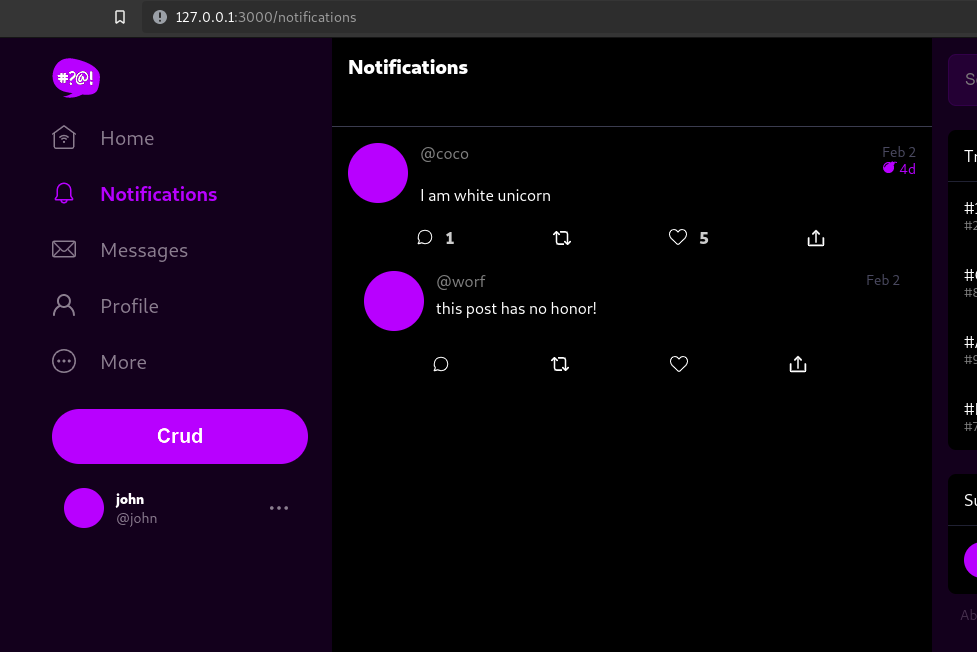
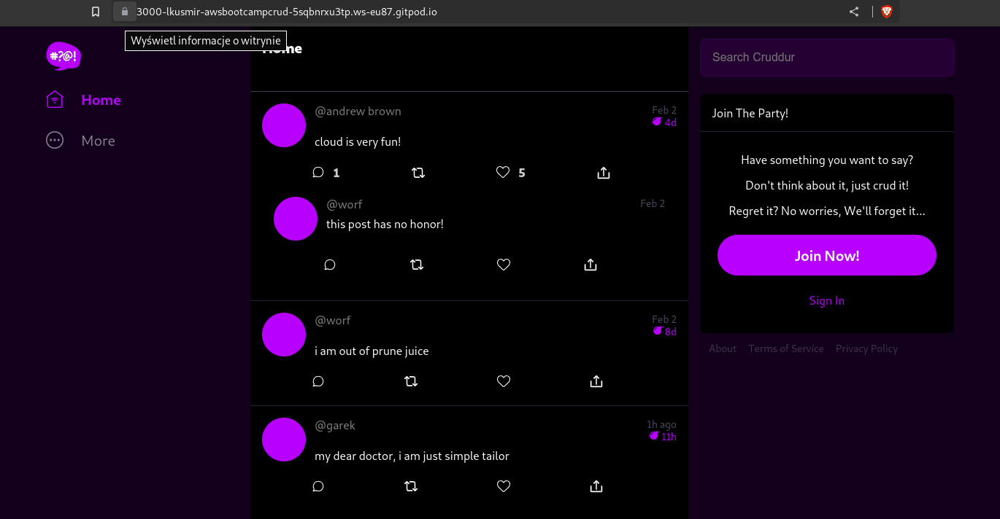

# Week 1 — App Containerization

## Home assignment

1. Run the docker CMD as en external script.

```bash
docker run backend-flask:1.0-SNAPSHOT /shell /script
```

2. Push and tag an image to dockerhub

  * Pushing the image to [dockerhub](https://hub.docker.com)
  
  ```bash
  # Login to repository
  $ docker login docker.io
  Authenticating with existing credentials...
  Login Succeeded
  # Tag images appropriately
  $ docker tag backend-flask:1.0-SNAPSHOT lkusmir/backend-flask:1.0-SNAPSHOT
  $ docker tag backend-flask:1.1-SNAPSHOT lkusmir/backend-flask:1.1-SNAPSHOT
  $ docker tag backend-flask:latest lkusmir/backend-flask
  $ docker tag frontend-react-js:1.0-SNAPSHOT lkusmir/frontend-react-js:1.0-SNAPSHOT
  $ docker tag frontend-react-js:1.1-SNAPSHOT lkusmir/frontend-react-js:1.1-SNAPSHOT
  $ docker tag frontend-react-js:latest lkusmir/frontend-react-js
  $ docker image list 
  lkusmir/frontend-react-js                     1.1-SNAPSHOT        55eeb3e3cc5e        23 hours ago        1.2GB
  lkusmir/frontend-react-js                     latest              55eeb3e3cc5e        23 hours ago        1.2GB
  lkusmir/backend-flask                         1.1-SNAPSHOT        e19dd292f3ed        24 hours ago        129MB
  lkusmir/backend-flask                         latest              e19dd292f3ed        24 hours ago        129MB
  lkusmir/frontend-react-js                     1.0-SNAPSHOT        aa76de3305c7        40 hours ago        1.2GB
  lkusmir/backend-flask                         1.0-SNAPSHOT        1cd618986456        40 hours ago        129MB

  # Push the tempo, push the tempo
  # Note some layers are already mounted by library/node :)
  $ docker push lkusmir/frontend-react-js
  The push refers to repository [docker.io/lkusmir/frontend-react-js]
  3ca38fa3fd88: Pushed 
  67232742a947: Pushed 
  8dcc2270b2a4: Mounted from library/node 
  60a3cb9a013a: Mounted from library/node 
  31880ac21a09: Mounted from library/node 
  86b22c61669b: Mounted from library/node 
  dec5d443c5c1: Mounted from library/node 
  753fac84fc56: Mounted from library/node 
  81fcd676802f: Mounted from library/node 
  6a1754327612: Mounted from library/node 
  3943af3b0cbd: Mounted from library/node 
  1.0-SNAPSHOT: digest: sha256:ed2f8bda0eee4a7039814d0a168f2870a436a0f8663246344e06a3856f62bfd4 size: 2639
  (...)
  lkusmir/backend-flask                         1.0-SNAPSHOT        1cd618986456        40 hours ago        129MB
  (...)
  lkusmir/backend-flask                         1.0-SNAPSHOT        1cd618986456        40 hours ago        129MB

  $ docker push lkusmir/backend-flask
  The push refers to repository [docker.io/lkusmir/backend-flask]1.0-SNAPSHOT: digest: sha256:b70f4f0c30fe04148444135422ee8e3a456548106befb2ebcfea37c12fcb253b size: 2203
  1.1-SNAPSHOT: digest: sha256:8ab8998936457e3f5a71e823fef52621aaf08934d008eb4171c0ba9fb288fccb size: 2203
  latest: digest: sha256:8ab8998936457e3f5a71e823fef52621aaf08934d008eb4171c0ba9fb288fccb size: 2203
  # Images can be pushed if required
  $ docker pull lkusmir/frontend-react-js
  Using default tag: latest
  docker pulatest: Pulling from lkusmir/frontend-react-js
  Digest: sha256:dab06c5e9d5d045eb28026577307e2610c41432255527cdc87674647eba5cc84
  Status: Image is up to date for lkusmir/frontend-react-js:latest
  $ docker pull lkusmir/backend-flask
  Using default tag: latest
  latest: Pulling from lkusmir/backend-flask
  Digest: sha256:8ab8998936457e3f5a71e823fef52621aaf08934d008eb4171c0ba9fb288fccb
  Status: Image is up to date for lkusmir/backend-flask:latest
  ```

  * Pushing the image to [quay.io](https://quay.io) repository (since why not).

  ```bash
  # Login to repository
  $ docker login quay.io
  Authenticating with existing credentials...
  Login Succeeded
  # Tag images appropriately
  $ docker tag backend-flask:1.0-SNAPSHOT quay.io/lkusmir/snapshots/backend-flask:1.0-SNAPSHOT
  $ docker tag backend-flask:1.1-SNAPSHOT quay.io/lkusmir/snapshots/backend-flask:1.1-SNAPSHOT
  $ docker tag backend-flask:1.1-SNAPSHOT quay.io/lkusmir/snapshots/backend-flask
  $ docker tag frontend-react-js:1.0-SNAPSHOT quay.io/lkusmir/snapshots/frontend-react-js:1.0-SNAPSHOT
  $ docker tag frontend-react-js:1.1-SNAPSHOT quay.io/lkusmir/snapshots/frontend-react-js:1.1-SNAPSHOT
  $ docker tag frontend-react-js:1.1-SNAPSHOT quay.io/lkusmir/snapshots/frontend-react-js
  $ docker image list | grep quay
  quay.io/lkusmir/snapshots/frontend-react-js   1.1-SNAPSHOT        55eeb3e3cc5e        22 hours ago        1.2GB
  quay.io/lkusmir/snapshots/frontend-react-js   latest              55eeb3e3cc5e        22 hours ago        1.2GB
  quay.io/lkusmir/snapshots/backend-flask       1.1-SNAPSHOT        e19dd292f3ed        22 hours ago        129MB
  quay.io/lkusmir/snapshots/backend-flask       latest              e19dd292f3ed        22 hours ago        129MB
  quay.io/lkusmir/snapshots/frontend-react-js   1.0-SNAPSHOT        aa76de3305c7        38 hours ago        1.2GB
  quay.io/lkusmir/snapshots/backend-flask       1.0-SNAPSHOT        1cd618986456        38 hours ago        129MB

  # Push images to repository
  $ docker push quay.io/lkusmir/snapshots/backend-flask 
  The push refers to repository [quay.io/lkusmir/snapshots/backend-flask]
  1.0-SNAPSHOT: digest: sha256:b70f4f0c30fe04148444135422ee8e3a456548106befb2ebcfea37c12fcb253b size: 2203
  1.1-SNAPSHOT: digest: sha256:8ab8998936457e3f5a71e823fef52621aaf08934d008eb4171c0ba9fb288fccb size: 2203
  latest: digest: sha256:8ab8998936457e3f5a71e823fef52621aaf08934d008eb4171c0ba9fb288fccb size: 2203
  $ docker push quay.io/lkusmir/snapshots/frontend-react-js
  The push refers to repository [quay.io/lkusmir/snapshots/frontend-react-js]
  1.0-SNAPSHOT: digest: sha256:ed2f8bda0eee4a7039814d0a168f2870a436a0f8663246344e06a3856f62bfd4 size: 2639
  1.1-SNAPSHOT: digest: sha256:dab06c5e9d5d045eb28026577307e2610c41432255527cdc87674647eba5cc84 size: 2639
  latest: digest: sha256:dab06c5e9d5d045eb28026577307e2610c41432255527cdc87674647eba5cc84 size: 2639
  # Note: then pushing newer version - some layers already existed ;)
  # the upload is completed. The containers are available. Additionally I've marked the 1.1-SNAPSHOT with the `latest` tag
  $ docker pull quay.io/lkusmir/snapshots/frontend-react-js
  Using default tag: latest
  latest: Pulling from lkusmir/snapshots/frontend-react-js
  Digest: sha256:dab06c5e9d5d045eb28026577307e2610c41432255527cdc87674647eba5cc84
  Status: Image is up to date for quay.io/lkusmir/snapshots/frontend-react-js:latest
  $ docker pull quay.io/lkusmir/snapshots/frontend-react-js
  Using default tag: latest
  latest: Pulling from lkusmir/snapshots/frontend-react-js
  Digest: sha256:dab06c5e9d5d045eb28026577307e2610c41432255527cdc87674647eba5cc84
  Status: Image is up to date for quay.io/lkusmir/snapshots/frontend-react-js:latest
  ```

3. Multistage building for a Dockerfile

4. Implement a healthcheck in the V3 Docker compos file

  Relevant documentation:
  * [compose healthcheck](https://docs.docker.com/compose/compose-file/compose-file-v3/)
  * [docker docs](https://docs.docker.com/engine/reference/builder/#healthcheck)

  Added a simplimistic API Endpoint `/api/status` to the Backend and a Healthcheck to `docker-compose.yml`.
  Performed a check - works as exptected.
    
  *Docker status check*

5. Research best practices of Dockerfile and attempt to implement it in your Dockerfile

  Some of the [best practices](https://docs.docker.com/develop/develop-images/dockerfile_best-practices/) implemented:

  * Application code [testing for vulnerabilites](https://sonarcloud.io/project/overview?id=lkusmir_aws-bootcamp-cruddur-2023) before production use. Shift left when possible.

    
  *Sonar code quality scan within IDE*

  * Artifacts scanning for vulnerabilites

  Here we could use of of the tools available on the market, tor example Jfrog Xray (non-free). Most of the repositories have some kind of security scan enabled. Check out the results for the [frontend](https://quay.io/repository/lkusmir/snapshots/frontend-react-js/manifest/sha256:dab06c5e9d5d045eb28026577307e2610c41432255527cdc87674647eba5cc84?tab=vulnerabilities) and [backend](https://quay.io/repository/lkusmir/snapshots/backend-flask/manifest/sha256:8ab8998936457e3f5a71e823fef52621aaf08934d008eb4171c0ba9fb288fccb?tab=vulnerabilities) image scan with [Clair](https://quay.github.io/clair/howto/testing.html).

    
  *Example scan result*

* keeping runtimes updated 

Added apt to BackEnd Dockerfile

* basic data within dockerfile -author etc
* no sensitive data in docker files or images + SecretMgmtService - vault
* RO filesystem and Volume 
* separate db for LTS - actually I'd recommend treating all artifacts as ephemeral. The only source of truth should be within the code. Don't estimate the container has to last within repo for longer than the build process
* Code tested for Vulnerabilities before production use

* commands order matters
* don't do root - rootless is the new black
* image vulnerability scanning - https://snyk.io/ or sonarqube
* use explicit versions
* keep it small - decrease container size


6. Learn how to install Docker on your localmachine and get the same containes running outside of Gitpod/codespaces

    [Installation procedure](https://docs.docker.com/engine/install/debian/) on my local machine.

    Building and running the application locally:
    ```bash
    $ pwd
    /home/lkusmir/git/aws-bootcamp-cruddur-2023/backend-flask

    $ docker build -t backend-flask:1.0-SNAPSHOT .
    Sending build context to Docker daemon  33.79kB
    (...)
    Successfully built 1cd618986456
    Successfully tagged backend-flask:1.0-SNAPSHOT

    $ pwd
    /home/lkusmir/git/aws-bootcamp-cruddur-2023/frontend-react-js

    $ npm i
    added 1470 packages from 685 contributors and audited 1471 packages in 100.818s
    (...)

    $ docker build -t frontend-react-js:1.0-SNAPSHOT .
    Successfully built aa76de3305c7
    Successfully tagged frontend-react-js:1.0-SNAPSHOT

    $ docker image list
    REPOSITORY                                    TAG                 IMAGE ID            CREATED             SIZE
    frontend-react-js                             1.0-SNAPSHOT        aa76de3305c7        32 seconds ago      1.2GB
    backend-flask                                 1.0-SNAPSHOT        1cd618986456        14 minutes ago      129MB

    $ docker run -e FRONTEND_URL="*" -e BACKEND_URL="*" -d -p 4567:4567 backend-flask:1.0-SNAPSHOT
    87ea942d63221c13e9a49ee36840a9dcdbddacd25991a63b1382f96e7a19601b
    $ docker run -e REACT_APP_BACKEND_URL="http://localhost:4567" -d -p 3000:3000 frontend-react-js:1.0-SNAPSHOT 
    c9e70930ccff4b1b32193037d1f122d402f2de86f7029a2b38dc36c47d3e7593
    ```

    
    *Backend running locally*

    
    *Application running locally.*

    TODO: Second approach with docker-compose?

7. Launch an EC2 instance that has docker installed, and pull a container to demonstrate you can run your own docker processes


## Additional information

1. One can utilize docker to run [super-linter](https://github.com/github/super-linter#filter-linted-files) locally. Let's limit the scope of test for the `./journal` directory for now.

```bash
$ docker run -e RUN_LOCAL=true -e FILTER_REGEX_INCLUDE=./journal/* -v $PWD:/tmp/lint github/super-linter
(...)
2023-02-19 00:11:58 [INFO]   The script has completed
2023-02-19 00:11:58 [INFO]   ----------------------------------------------
2023-02-19 00:11:58 [INFO]   ----------------------------------------------
2023-02-19 00:11:58 [ERROR]   ERRORS FOUND in MARKDOWN:[2]
2023-02-19 00:11:59 [FATAL]   Exiting with errors found!
```
2. Add postgres and dynamodb

  

  Services were operational - checked accordingly.

## Week1 -  Notes from the meetup

### Cast

Aedith Pucila  
James Spurin

### Script

We were following the [procedure](https://github.com/omenking/aws-bootcamp-cruddur-2023/blob/week-1/journal/week1.md).

Worth reading:
* [Docker compose](https://docs.docker.com/compose/gettingstarted/)
* [Dockerfile reference](https://docs.docker.com/engine/reference/builder/)

### Notes

#### Building frontend

```bash
$ docker build -t backend-flask:1.0-SNAPSHOT .

$ docker image ls
REPOSITORY                                    TAG                 IMAGE ID            CREATED              SIZE
backend-flask                                 1.0-SNAPSHOT        e5a3394e5f89        About a minute ago   129MB

$ docker run -e FRONTEND_URL="*" -e BACKEND_URL="*" -d -p 4567:4567 backend-flask:1.0-SNAPSHOT
7fef9eb4b57f2e992a7b6acb4034f152eeb14f66d1f3d3cd087c95b4f189740a
✔ ~/git/aws-bootcamp-cruddur-2023/backend-flask [3-week1-actions|✚ 1…1] 

$ docker ps
CONTAINER ID        IMAGE                        COMMAND                  CREATED             STATUS              PORTS                    NAMES
7fef9eb4b57f        backend-flask:1.0-SNAPSHOT   "python3 -m flask ru…"   10 minutes ago      Up 10 minutes       0.0.0.0:4567->4567/tcp   flamboyant_pike

$ curl 127.0.0.1:4567/api/activities/home
[
  {
    "created_at": "2023-02-16T18:44:39.933036+00:00",
    "expires_at": "2023-02-23T18:44:39.933036+00:00",
    "handle": "Andrew Brown",
    "likes_count": 5,
    "message": "Cloud is fun!",
    "replies": [
      {
        "created_at": "2023-02-16T18:44:39.933036+00:00",
        "handle": "Worf",
        "likes_count": 0,
        "message": "This post has no honor!",
        "replies_count": 0,
        "reply_to_activity_uuid": "68f126b0-1ceb-4a33-88be-d90fa7109eee",
        "reposts_count": 0,
        "uuid": "26e12864-1c26-5c3a-9658-97a10f8fea67"
      }
(...)
```

#### Building the app - docker compose

**HINT:** Remeber to `npm -i` in the frontend dir before docker compose.

**HINT:** R-click on the codker-compose.yml for an action.

```bash
docker-compose -f "docker-compose.yml" up -d --build 
```


*Application running on GitPod*

**WARNING:** Note it was initally running without frontend-backend connection due to typo in `docker-compose.yml`. Fixed.

```bash
$ curl https://3000-lkusmir-awsbootcampcrud-dtlch9mjm9e.ws-eu87.gitpod.io/
<!DOCTYPE html>
<html lang="en">
  <head>
    <meta charset="utf-8" />
(...)
  </body>
</html>
```

